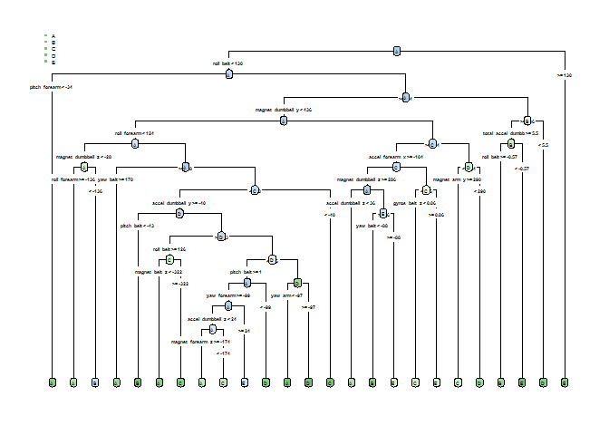

    knitr::opts_chunk$set(echo = TRUE)

Overview
--------

The awareness on the fitness is increasing day-by-day and nowadays
people are very consciously monitoring how much of a particular activity
they do. In order to reap full benefits, it is also important to do the
physical activities in the correct way and awareness on the same is
lacking.

Six young health participants were asked to perform one set of 10
repetitions of the Unilateral Dumbbell Biceps Curl in five different
fashions: exactly according to the specification (Class A), throwing the
elbows to the front (Class B), lifting the dumbbell only halfway (Class
C), lowering the dumbbell only halfway (Class D) and throwing the hips
to the front (Class E) (\*)

In this project, our goal is to use data from accelerometers on the
belt, forearm, arm, and dumbbell of these 6 participants and build a
model to predict the manner in which the exercises were done. The data
sets were taken from below site.

<http://groupware.les.inf.puc-rio.br/har#ixzz4cpFOJ4A8>

Reference: Velloso, E.; Bulling, A.; Gellersen, H.; Ugulino, W.; Fuks,
H. Qualitative Activity Recognition of Weight Lifting Exercises.
Proceedings of 4th International Conference in Cooperation with SIGCHI
(Augmented Human '13) . Stuttgart, Germany: ACM SIGCHI, 2013.

Approach steps
--------------

-   Load training and testing data and partitioning
-   Data Processing (Dimension reduction)
-   Remove variables where all values are missing
-   Remove variables with "near zero values" or "near zero variance"
-   Remove variables which do not have significance for building
    model, i.e. these are only used to identify a particular row of data

-   Apply all transformations done to training data to the validation
    data and test data

-   Build a model using random forest algorithm
-   Validate the model on validation data
-   Ensure that confusion matrix suggests high accuracy
-   Apply the model to predict values of "classe" for testing dataset

Load training and testing data and partitioning
-----------------------------------------------

We will read the training and testing data and partition training data
to training and validation data

    # Read files, replace #div/0!, and "" with NA
    set.seed(23465)
    library(caret)

    ## Loading required package: lattice

    ## Loading required package: ggplot2

    library(randomForest)

    ## randomForest 4.6-12

    ## Type rfNews() to see new features/changes/bug fixes.

    ## 
    ## Attaching package: 'randomForest'

    ## The following object is masked from 'package:ggplot2':
    ## 
    ##     margin

    library(rpart)
    library(rpart.plot)
    library(reprtree)

    ## Loading required package: tree

    ## Loading required package: plotrix

    library(rattle)                 

    ## Rattle: A free graphical interface for data mining with R.
    ## Version 4.1.0 Copyright (c) 2006-2015 Togaware Pty Ltd.
    ## Type 'rattle()' to shake, rattle, and roll your data.

    library(rpart.plot)         
    library(RColorBrewer)       
    library(party)                  

    ## Loading required package: grid

    ## Loading required package: mvtnorm

    ## Loading required package: modeltools

    ## Loading required package: stats4

    ## Loading required package: strucchange

    ## Loading required package: zoo

    ## 
    ## Attaching package: 'zoo'

    ## The following objects are masked from 'package:base':
    ## 
    ##     as.Date, as.Date.numeric

    ## Loading required package: sandwich

    library(partykit)               

    ## 
    ## Attaching package: 'partykit'

    ## The following objects are masked from 'package:party':
    ## 
    ##     cforest, ctree, ctree_control, edge_simple, mob, mob_control,
    ##     node_barplot, node_bivplot, node_boxplot, node_inner,
    ##     node_surv, node_terminal

    # replace #div/0!, and "" with NA so that the data is clean and a consistent logic can be applied
    trainset <- read.csv("pml-training.csv",na.strings=c("NA","#DIV/0!", ""))
    testset <- read.csv("pml-testing.csv",na.strings=c("NA","#DIV/0!", ""))
    dim(trainset)

    ## [1] 19622   160

    dim(testset)

    ## [1]  20 160

    #create partition on training data
    inTrain <- createDataPartition(y=trainset$classe, p=0.70, list=FALSE)
    traindata <- trainset[inTrain, ] 
    validationdata <- trainset[-inTrain, ]

Data Processing (Dimension reduction)
-------------------------------------

There are 159 variables in the training set and we will now identify the
variables which are not important in our modeling and therefore can be
dropped from analysis. The first 7 columns are just data related to
identification of the individual observations and therefore can be
dropped. so we will drop variables user\_name, raw\_timestamp\_part\_1,
raw\_timestamp\_part\_2, cvtd\_timestamp, new\_window, num\_window

    traindata <- traindata[,-c(1:7)]
    dim(traindata)

    ## [1] 13737   153

    # Next we will remove variables which have near zero values or near zero variance
    nzv <- nearZeroVar(traindata)
    filteredtraindata <- traindata[, -nzv]

    dim(filteredtraindata)

    ## [1] 13737   124

    # let us reduce the dimesnsions by removing variables which have NA values in most rows
    filteredtraindata<-filteredtraindata[,colSums(is.na(filteredtraindata)) == 0]
    dim(filteredtraindata)

    ## [1] 13737    53

We can now see that as a result of above steps we have been able to
reduce the number of variables from 159 to 53, we can now repeat this
transformation process to validation data and testing data

Apply all transformations done to training data to the validation data and test data
------------------------------------------------------------------------------------

    # Repeat the transformations to validation data and testing dataset
    validationdata <-validationdata[names(filteredtraindata)]
    dim(validationdata)

    ## [1] 5885   53

    # testing data doesn't have "classe"" column, so we need to exclude it from below transformation
    testvariables <-colnames(filteredtraindata[,-53])
    testset <-testset[testvariables]
    dim(testset)

    ## [1] 20 52

As expected, the number of variables in validation data is same as that
in training data (since it is a subset of training data) and the number
of variables in testing data is one less than training data as the
predicator variable "classe" is missing for the same.

Build a model using random forest algorithm
-------------------------------------------

    ## Use randomForest for model fitting
    fit1 <- randomForest(classe ~ ., data=filteredtraindata)
    ## Apply model to predict values for validation data set and check accuracy

    predicvalRF <- predict(fit1,validationdata,type="class",na.action=na.exclude)
    cmRF <- confusionMatrix(predicvalRF,validationdata$classe)
    print(cmRF)

    ## Confusion Matrix and Statistics
    ## 
    ##           Reference
    ## Prediction    A    B    C    D    E
    ##          A 1674    6    0    0    0
    ##          B    0 1133    4    0    0
    ##          C    0    0 1021    7    4
    ##          D    0    0    1  955    1
    ##          E    0    0    0    2 1077
    ## 
    ## Overall Statistics
    ##                                           
    ##                Accuracy : 0.9958          
    ##                  95% CI : (0.9937, 0.9972)
    ##     No Information Rate : 0.2845          
    ##     P-Value [Acc > NIR] : < 2.2e-16       
    ##                                           
    ##                   Kappa : 0.9946          
    ##  Mcnemar's Test P-Value : NA              
    ## 
    ## Statistics by Class:
    ## 
    ##                      Class: A Class: B Class: C Class: D Class: E
    ## Sensitivity            1.0000   0.9947   0.9951   0.9907   0.9954
    ## Specificity            0.9986   0.9992   0.9977   0.9996   0.9996
    ## Pos Pred Value         0.9964   0.9965   0.9893   0.9979   0.9981
    ## Neg Pred Value         1.0000   0.9987   0.9990   0.9982   0.9990
    ## Prevalence             0.2845   0.1935   0.1743   0.1638   0.1839
    ## Detection Rate         0.2845   0.1925   0.1735   0.1623   0.1830
    ## Detection Prevalence   0.2855   0.1932   0.1754   0.1626   0.1833
    ## Balanced Accuracy      0.9993   0.9969   0.9964   0.9951   0.9975

    # The output of random forest node-1 of tree is included in Appendix

Build a model using decision tree of rpart
------------------------------------------

    ## Use rpart for model fitting

    fit2 <- rpart(classe ~ ., data=filteredtraindata, method="class")
    predicvalRP <- predict(fit2,validationdata,type="class",na.action=na.exclude)
    cmRP <- confusionMatrix(predicvalRP,validationdata$classe)
    print(cmRP)

    ## Confusion Matrix and Statistics
    ## 
    ##           Reference
    ## Prediction    A    B    C    D    E
    ##          A 1540  172   17   67   15
    ##          B   46  594   43   57   80
    ##          C   39  222  883   98  138
    ##          D   34   71   82  677   95
    ##          E   15   80    1   65  754
    ## 
    ## Overall Statistics
    ##                                           
    ##                Accuracy : 0.7558          
    ##                  95% CI : (0.7446, 0.7668)
    ##     No Information Rate : 0.2845          
    ##     P-Value [Acc > NIR] : < 2.2e-16       
    ##                                           
    ##                   Kappa : 0.6907          
    ##  Mcnemar's Test P-Value : < 2.2e-16       
    ## 
    ## Statistics by Class:
    ## 
    ##                      Class: A Class: B Class: C Class: D Class: E
    ## Sensitivity            0.9200   0.5215   0.8606   0.7023   0.6969
    ## Specificity            0.9356   0.9524   0.8977   0.9427   0.9665
    ## Pos Pred Value         0.8504   0.7244   0.6399   0.7059   0.8240
    ## Neg Pred Value         0.9671   0.8924   0.9683   0.9417   0.9340
    ## Prevalence             0.2845   0.1935   0.1743   0.1638   0.1839
    ## Detection Rate         0.2617   0.1009   0.1500   0.1150   0.1281
    ## Detection Prevalence   0.3077   0.1393   0.2345   0.1630   0.1555
    ## Balanced Accuracy      0.9278   0.7369   0.8792   0.8225   0.8317

    prp(fit2,fallen.leaves=TRUE,tweak=1.6,type=4,box.palette="BuGn")

Results and Conclusions
-----------------------

We have seen above that it is crucial to remove the insignificant
variables from the data for the predication model, if considered in the
model, it could introduce a false influence and therefore result in
inaccuracy in the model. By reducing number of variables from 159 to 53
and applying random forest method for prediction, we have been able to
achieve a highly accurate prediction of 99.44% which varies between
99.21% and 99.61% for a 95% confidence level. As expected, the accuracy
of rpart method is much less as compared to random forest. The accuracy
is 77.58% which varies between 74.46% and 76.68% for a 95% confidence
level. We will therefore use randam forest fit to predict the "classe""
values for test data.

    predicvaltest <- predict(fit1, testset,type = "class")
    print(predicvaltest)

    ##  1  2  3  4  5  6  7  8  9 10 11 12 13 14 15 16 17 18 19 20 
    ##  B  A  B  A  A  E  D  B  A  A  B  C  B  A  E  E  A  B  B  B 
    ## Levels: A B C D E

Appendix: Output of tree structure used by Random Forest
--------------------------------------------------------

    getTree(fit1,k=1)

    ##      left daughter right daughter split var split point status prediction
    ## 1                2              3        10 -186.500000      1          0
    ## 2                4              5        47  145.000000      1          0
    ## 3                6              7        27   64.342073      1          0
    ## 4                0              0         0    0.000000     -1          5
    ## 5                8              9         2   25.500000      1          0
    ## 6               10             11        35  -32.500000      1          0
    ## 7               12             13        38  521.500000      1          0
    ## 8                0              0         0    0.000000     -1          5
    ## 9                0              0         0    0.000000     -1          1
    ## 10              14             15        37 -442.500000      1          0
    ## 11              16             17        47  217.500000      1          0
    ## 12              18             19        30    6.500000      1          0
    ## 13              20             21        12  586.000000      1          0
    ## 14              22             23        30    8.500000      1          0
    ## 15              24             25         2   24.500000      1          0
    ## 16              26             27        14  -30.450000      1          0
    ## 17              28             29        37 -426.000000      1          0
    ## 18              30             31        17   33.500000      1          0
    ## 19              32             33        36 -120.500000      1          0
    ## 20               0              0         0    0.000000     -1          5
    ## 21              34             35         6   -0.025000      1          0
    ## 22              36             37         1  117.500000      1          0
    ## 23              38             39         2   13.450000      1          0
    ## 24              40             41         4    9.500000      1          0
    ## 25              42             43        47 -142.500000      1          0
    ## 26              44             45        38  386.500000      1          0
    ## 27              46             47        41    6.540000      1          0
    ## 28              48             49        38  281.500000      1          0
    ## 29              50             51        33   -0.255000      1          0
    ## 30              52             53        41    6.960000      1          0
    ## 31              54             55        22  -27.500000      1          0
    ## 32              56             57         1   -0.850000      1          0
    ## 33              58             59        31   -0.475000      1          0
    ## 34              60             61        33   -0.450000      1          0
    ## 35              62             63        30    6.500000      1          0
    ## 36              64             65        21 -293.000000      1          0
    ## 37              66             67         7   -0.065000      1          0
    ## 38              68             69        38  241.000000      1          0
    ## 39              70             71        50 -171.000000      1          0
    ## 40              72             73        33    0.155000      1          0
    ## 41              74             75        43   16.000000      1          0
    ## 42              76             77        37  497.500000      1          0
    ## 43              78             79        15   29.850000      1          0
    ## 44              80             81        23 -197.000000      1          0
    ## 45              82             83        29  -19.265275      1          0
    ## 46              84             85        27   14.488490      1          0
    ## 47              86             87        34   66.500000      1          0
    ## 48              88             89        25  313.500000      1          0
    ## 49              90             91        22  142.500000      1          0
    ## 50               0              0         0    0.000000     -1          2
    ## 51              92             93        15    4.280000      1          0
    ## 52              94             95        16   87.850000      1          0
    ## 53              96             97        38  258.000000      1          0
    ## 54              98             99        28   10.071255      1          0
    ## 55             100            101        31    1.080000      1          0
    ## 56               0              0         0    0.000000     -1          5
    ## 57             102            103        24  295.500000      1          0
    ## 58             104            105         3  150.000000      1          0
    ## 59             106            107        14   79.350000      1          0
    ## 60             108            109        31    0.000000      1          0
    ## 61               0              0         0    0.000000     -1          5
    ## 62             110            111        50 -428.500000      1          0
    ## 63             112            113        25  301.500000      1          0
    ## 64               0              0         0    0.000000     -1          1
    ## 65             114            115         1    1.660000      1          0
    ## 66             116            117         1  123.000000      1          0
    ## 67             118            119        15   16.500000      1          0
    ## 68             120            121        40   16.000000      1          0
    ## 69               0              0         0    0.000000     -1          5
    ## 70               0              0         0    0.000000     -1          3
    ## 71               0              0         0    0.000000     -1          2
    ## 72             122            123        33   -0.615000      1          0
    ## 73               0              0         0    0.000000     -1          2
    ## 74               0              0         0    0.000000     -1          3
    ## 75             124            125        25  256.000000      1          0
    ## 76               0              0         0    0.000000     -1          4
    ## 77             126            127        27  -43.445428      1          0
    ## 78             128            129        13 -383.500000      1          0
    ## 79             130            131        38 -606.000000      1          0
    ## 80             132            133         2  -40.100000      1          0
    ## 81             134            135        25   96.500000      1          0
    ## 82             136            137        26 -129.000000      1          0
    ## 83             138            139        42 -139.500000      1          0
    ## 84             140            141        13 -379.500000      1          0
    ## 85             142            143         2  -43.150000      1          0
    ## 86             144            145        24  237.500000      1          0
    ## 87             146            147        52 -580.000000      1          0
    ## 88             148            149        23 -208.000000      1          0
    ## 89               0              0         0    0.000000     -1          3
    ## 90             150            151        39   62.500000      1          0
    ## 91             152            153        19    0.565000      1          0
    ## 92               0              0         0    0.000000     -1          5
    ## 93               0              0         0    0.000000     -1          2
    ## 94             154            155        49 -221.000000      1          0
    ## 95             156            157        12  583.000000      1          0
    ## 96             158            159         1    0.530000      1          0
    ## 97             160            161         8  -11.500000      1          0
    ## 98             162            163        43   32.500000      1          0
    ## 99               0              0         0    0.000000     -1          4
    ## 100            164            165        38  256.000000      1          0
    ## 101              0              0         0    0.000000     -1          4
    ## 102            166            167        39   29.000000      1          0
    ## 103            168            169        37 -395.000000      1          0
    ## 104              0              0         0    0.000000     -1          5
    ## 105            170            171        19   -1.220000      1          0
    ## 106            172            173        31    0.395000      1          0
    ## 107            174            175         2    5.435000      1          0
    ## 108              0              0         0    0.000000     -1          5
    ## 109              0              0         0    0.000000     -1          2
    ## 110            176            177        23 -231.000000      1          0
    ## 111            178            179        12  610.000000      1          0
    ## 112            180            181        11   -8.000000      1          0
    ## 113            182            183        27  117.396838      1          0
    ## 114            184            185        28   -1.513484      1          0
    ## 115            186            187         7    0.105000      1          0
    ## 116            188            189        34  -15.500000      1          0
    ## 117              0              0         0    0.000000     -1          5
    ## 118              0              0         0    0.000000     -1          5
    ## 119              0              0         0    0.000000     -1          4
    ## 120              0              0         0    0.000000     -1          2
    ## 121              0              0         0    0.000000     -1          4
    ## 122              0              0         0    0.000000     -1          3
    ## 123              0              0         0    0.000000     -1          1
    ## 124            190            191        13 -331.000000      1          0
    ## 125              0              0         0    0.000000     -1          2
    ## 126              0              0         0    0.000000     -1          2
    ## 127              0              0         0    0.000000     -1          1
    ## 128            192            193        30   14.000000      1          0
    ## 129            194            195        11    7.500000      1          0
    ## 130            196            197        16   24.900000      1          0
    ## 131              0              0         0    0.000000     -1          4
    ## 132            198            199        49   37.500000      1          0
    ## 133            200            201        37  506.000000      1          0
    ## 134            202            203         3   -4.695000      1          0
    ## 135            204            205        45    3.245000      1          0
    ## 136            206            207        50 -238.500000      1          0
    ## 137            208            209        39   -4.000000      1          0
    ## 138            210            211        52  330.000000      1          0
    ## 139            212            213         7   -0.090000      1          0
    ## 140            214            215        37 -472.500000      1          0
    ## 141            216            217        51  678.500000      1          0
    ## 142            218            219        39   62.500000      1          0
    ## 143            220            221        50  395.000000      1          0
    ## 144            222            223        49 -164.500000      1          0
    ## 145            224            225        13 -383.500000      1          0
    ## 146              0              0         0    0.000000     -1          1
    ## 147            226            227        36   60.500000      1          0
    ## 148            228            229        38  199.500000      1          0
    ## 149            230            231         3   37.350000      1          0
    ## 150            232            233        27   54.674166      1          0
    ## 151            234            235         2    2.330000      1          0
    ## 152            236            237        44   -1.130000      1          0
    ## 153            238            239        43   40.000000      1          0
    ## 154            240            241        15   15.695000      1          0
    ## 155            242            243        31   -0.475000      1          0
    ## 156              0              0         0    0.000000     -1          3
    ## 157            244            245        35   25.000000      1          0
    ## 158              0              0         0    0.000000     -1          4
    ## 159            246            247        31   -0.250000      1          0
    ## 160            248            249        28    1.988020      1          0
    ## 161            250            251        16  -26.600000      1          0
    ## 162              0              0         0    0.000000     -1          2
    ## 163              0              0         0    0.000000     -1          5
    ## 164            252            253        13 -426.500000      1          0
    ## 165              0              0         0    0.000000     -1          1
    ## 166            254            255        25  449.500000      1          0
    ## 167            256            257        48   -1.500000      1          0
    ## 168            258            259        47  -69.500000      1          0
    ## 169            260            261        47  -84.000000      1          0
    ## 170            262            263         5    0.395000      1          0
    ## 171              0              0         0    0.000000     -1          2
    ## 172            264            265        29  -83.460865      1          0
    ## 173            266            267         2  -43.050000      1          0
    ## 174            268            269         1  -12.550000      1          0
    ## 175            270            271        45   -0.395000      1          0
    ## 176              0              0         0    0.000000     -1          5
    ## 177            272            273        38  566.000000      1          0
    ## 178              0              0         0    0.000000     -1          2
    ## 179              0              0         0    0.000000     -1          5
    ## 180              0              0         0    0.000000     -1          5
    ## 181            274            275        13 -283.000000      1          0
    ## 182            276            277         1  129.000000      1          0
    ## 183            278            279        46    0.125000      1          0
    ## 184            280            281        37 -610.000000      1          0
    ## 185            282            283        26 -310.000000      1          0
    ## 186            284            285        13 -318.500000      1          0
    ## 187              0              0         0    0.000000     -1          5
    ## 188            286            287         3    4.345000      1          0
    ## 189            288            289         2   15.600000      1          0
    ## 190              0              0         0    0.000000     -1          5
    ## 191            290            291        45    2.015000      1          0
    ## 192              0              0         0    0.000000     -1          1
    ## 193              0              0         0    0.000000     -1          5
    ## 194            292            293        45    3.180000      1          0
    ## 195            294            295        40  115.500000      1          0
    ## 196              0              0         0    0.000000     -1          2
    ## 197              0              0         0    0.000000     -1          3
    ## 198            296            297        23 -294.500000      1          0
    ## 199              0              0         0    0.000000     -1          3
    ## 200            298            299         1  119.500000      1          0
    ## 201              0              0         0    0.000000     -1          2
    ## 202              0              0         0    0.000000     -1          2
    ## 203            300            301        39   21.000000      1          0
    ## 204            302            303        51 -506.000000      1          0
    ## 205              0              0         0    0.000000     -1          2
    ## 206            304            305        21  147.500000      1          0
    ## 207              0              0         0    0.000000     -1          2
    ## 208            306            307        52   51.500000      1          0
    ## 209              0              0         0    0.000000     -1          5
    ## 210              0              0         0    0.000000     -1          4
    ## 211            308            309        32   -0.055000      1          0
    ## 212            310            311         1  117.500000      1          0
    ## 213              0              0         0    0.000000     -1          5
    ## 214            312            313        23 -253.000000      1          0
    ## 215            314            315        14   87.200000      1          0
    ## 216              0              0         0    0.000000     -1          1
    ## 217            316            317        40  130.000000      1          0
    ## 218            318            319        24 -221.500000      1          0
    ## 219            320            321         7   -0.090000      1          0
    ## 220            322            323        38  302.500000      1          0
    ## 221              0              0         0    0.000000     -1          1
    ## 222            324            325        32   -0.330000      1          0
    ## 223            326            327         2    1.750000      1          0
    ## 224            328            329         3  -87.950000      1          0
    ## 225            330            331        37 -505.500000      1          0
    ## 226              0              0         0    0.000000     -1          5
    ## 227            332            333        27   53.961675      1          0
    ## 228              0              0         0    0.000000     -1          2
    ## 229              0              0         0    0.000000     -1          3
    ## 230              0              0         0    0.000000     -1          5
    ## 231              0              0         0    0.000000     -1          1
    ## 232            334            335         1   -1.080000      1          0
    ## 233            336            337        43   40.000000      1          0
    ## 234              0              0         0    0.000000     -1          5
    ## 235              0              0         0    0.000000     -1          3
    ## 236            338            339        12  631.000000      1          0
    ## 237            340            341         5    0.185000      1          0
    ## 238            342            343        23  -60.500000      1          0
    ## 239              0              0         0    0.000000     -1          3
    ## 240            344            345        52  419.500000      1          0
    ## 241              0              0         0    0.000000     -1          1
    ## 242              0              0         0    0.000000     -1          5
    ## 243            346            347        38  288.000000      1          0
    ## 244            348            349        13 -311.500000      1          0
    ## 245            350            351        51  966.000000      1          0
    ## 246              0              0         0    0.000000     -1          5
    ## 247            352            353        11   51.500000      1          0
    ## 248            354            355        35   24.500000      1          0
    ## 249            356            357        52  676.000000      1          0
    ## 250              0              0         0    0.000000     -1          5
    ## 251            358            359        22   36.000000      1          0
    ## 252              0              0         0    0.000000     -1          3
    ## 253              0              0         0    0.000000     -1          5
    ## 254            360            361        23    3.500000      1          0
    ## 255            362            363        41  -23.300000      1          0
    ## 256            364            365        52  291.000000      1          0
    ## 257            366            367        13 -333.000000      1          0
    ## 258            368            369         1  131.500000      1          0
    ## 259            370            371        34  -52.500000      1          0
    ## 260            372            373        39   90.000000      1          0
    ## 261            374            375        10   29.000000      1          0
    ## 262              0              0         0    0.000000     -1          3
    ## 263              0              0         0    0.000000     -1          2
    ## 264              0              0         0    0.000000     -1          1
    ## 265            376            377        52   86.000000      1          0
    ## 266            378            379         6    0.120000      1          0
    ## 267            380            381        36   59.500000      1          0
    ## 268            382            383        21 -133.000000      1          0
    ## 269            384            385        13 -426.500000      1          0
    ## 270              0              0         0    0.000000     -1          5
    ## 271            386            387        36   45.000000      1          0
    ## 272              0              0         0    0.000000     -1          4
    ## 273            388            389        15   -9.245000      1          0
    ## 274            390            391        13 -329.500000      1          0
    ## 275              0              0         0    0.000000     -1          5
    ## 276            392            393        39   92.500000      1          0
    ## 277              0              0         0    0.000000     -1          5
    ## 278            394            395        43   48.500000      1          0
    ## 279            396            397         9   16.500000      1          0
    ## 280            398            399        51  549.000000      1          0
    ## 281            400            401         9   -3.500000      1          0
    ## 282              0              0         0    0.000000     -1          2
    ## 283            402            403        37 -622.000000      1          0
    ## 284            404            405        51 -557.000000      1          0
    ## 285            406            407        36   -0.500000      1          0
    ## 286            408            409         2   15.100000      1          0
    ## 287              0              0         0    0.000000     -1          4
    ## 288              0              0         0    0.000000     -1          4
    ## 289              0              0         0    0.000000     -1          1
    ## 290              0              0         0    0.000000     -1          5
    ## 291            410            411        45    3.020000      1          0
    ## 292            412            413        35 -136.500000      1          0
    ## 293            414            415        10 -175.000000      1          0
    ## 294            416            417        43   34.500000      1          0
    ## 295              0              0         0    0.000000     -1          3
    ## 296            418            419        25 -113.500000      1          0
    ## 297              0              0         0    0.000000     -1          3
    ## 298              0              0         0    0.000000     -1          2
    ## 299              0              0         0    0.000000     -1          5
    ## 300            420            421        19   -1.580000      1          0
    ## 301            422            423         2  -41.050000      1          0
    ## 302              0              0         0    0.000000     -1          5
    ## 303            424            425        48  262.000000      1          0
    ## 304              0              0         0    0.000000     -1          5
    ## 305            426            427        48 -202.500000      1          0
    ## 306              0              0         0    0.000000     -1          2
    ## 307            428            429        35  -24.000000      1          0
    ## 308            430            431        19   -0.260000      1          0
    ## 309            432            433        29   68.915837      1          0
    ## 310              0              0         0    0.000000     -1          2
    ## 311            434            435         7   -0.190000      1          0
    ## 312              0              0         0    0.000000     -1          5
    ## 313            436            437        49  221.500000      1          0
    ## 314            438            439        22    2.000000      1          0
    ## 315            440            441        14   87.750000      1          0
    ## 316            442            443         2    7.490000      1          0
    ## 317            444            445        36    2.000000      1          0
    ## 318            446            447        52  605.500000      1          0
    ## 319            448            449         1  123.500000      1          0
    ## 320            450            451         2  -43.350000      1          0
    ## 321            452            453        23  115.000000      1          0
    ## 322            454            455        39   35.500000      1          0
    ## 323            456            457        23   33.000000      1          0
    ## 324            458            459         4    2.500000      1          0
    ## 325            460            461        42  104.500000      1          0
    ## 326            462            463        16   68.800000      1          0
    ## 327            464            465        22  156.500000      1          0
    ## 328            466            467        39  359.500000      1          0
    ## 329            468            469        52  103.500000      1          0
    ## 330            470            471        40  131.500000      1          0
    ## 331            472            473        19    0.955000      1          0
    ## 332            474            475        21  149.000000      1          0
    ## 333              0              0         0    0.000000     -1          5
    ## 334              0              0         0    0.000000     -1          5
    ## 335              0              0         0    0.000000     -1          2
    ## 336              0              0         0    0.000000     -1          1
    ## 337              0              0         0    0.000000     -1          3
    ## 338              0              0         0    0.000000     -1          2
    ## 339              0              0         0    0.000000     -1          3
    ## 340              0              0         0    0.000000     -1          1
    ## 341            476            477        13 -311.500000      1          0
    ## 342              0              0         0    0.000000     -1          1
    ## 343            478            479        45    2.400000      1          0
    ## 344              0              0         0    0.000000     -1          4
    ## 345              0              0         0    0.000000     -1          2
    ## 346            480            481        21  -68.500000      1          0
    ## 347            482            483         7   -0.190000      1          0
    ## 348              0              0         0    0.000000     -1          2
    ## 349              0              0         0    0.000000     -1          1
    ## 350              0              0         0    0.000000     -1          2
    ## 351              0              0         0    0.000000     -1          4
    ## 352            484            485        27   69.997481      1          0
    ## 353              0              0         0    0.000000     -1          4
    ## 354            486            487        37 -458.500000      1          0
    ## 355            488            489        31   -0.230000      1          0
    ## 356            490            491        11   31.500000      1          0
    ## 357            492            493        39  -15.000000      1          0
    ## 358              0              0         0    0.000000     -1          5
    ## 359              0              0         0    0.000000     -1          1
    ## 360            494            495         5   -0.155000      1          0
    ## 361            496            497        48  426.500000      1          0
    ## 362              0              0         0    0.000000     -1          2
    ## 363              0              0         0    0.000000     -1          1
    ## 364            498            499        26  578.000000      1          0
    ## 365              0              0         0    0.000000     -1          5
    ## 366              0              0         0    0.000000     -1          5
    ## 367            500            501        39  121.500000      1          0
    ## 368            502            503        14    0.735000      1          0
    ## 369              0              0         0    0.000000     -1          5
    ## 370            504            505        32   -0.155000      1          0
    ## 371            506            507        15  -67.950000      1          0
    ## 372              0              0         0    0.000000     -1          2
    ## 373              0              0         0    0.000000     -1          4
    ## 374              0              0         0    0.000000     -1          5
    ## 375            508            509        40  135.500000      1          0
    ## 376            510            511        28   -5.805321      1          0
    ## 377            512            513        35  164.000000      1          0
    ## 378            514            515         3  166.500000      1          0
    ## 379              0              0         0    0.000000     -1          3
    ## 380            516            517        19   -0.430000      1          0
    ## 381              0              0         0    0.000000     -1          4
    ## 382              0              0         0    0.000000     -1          5
    ## 383              0              0         0    0.000000     -1          4
    ## 384            518            519        17   42.500000      1          0
    ## 385            520            521        15   43.990000      1          0
    ## 386            522            523         9   -1.000000      1          0
    ## 387            524            525        23 -341.500000      1          0
    ## 388              0              0         0    0.000000     -1          5
    ## 389              0              0         0    0.000000     -1          2
    ## 390            526            527         2   11.525000      1          0
    ## 391            528            529        10   46.500000      1          0
    ## 392              0              0         0    0.000000     -1          2
    ## 393            530            531         2  -43.350000      1          0
    ## 394            532            533        41    2.090000      1          0
    ## 395              0              0         0    0.000000     -1          3
    ## 396              0              0         0    0.000000     -1          2
    ## 397              0              0         0    0.000000     -1          5
    ## 398              0              0         0    0.000000     -1          2
    ## 399              0              0         0    0.000000     -1          3
    ## 400              0              0         0    0.000000     -1          5
    ## 401            534            535        16  -89.350000      1          0
    ## 402              0              0         0    0.000000     -1          2
    ## 403            536            537        16   32.925000      1          0
    ## 404              0              0         0    0.000000     -1          1
    ## 405            538            539        39 -153.500000      1          0
    ## 406            540            541        34    0.500000      1          0
    ## 407            542            543        28  -53.976344      1          0
    ## 408            544            545        19   -1.260000      1          0
    ## 409              0              0         0    0.000000     -1          4
    ## 410              0              0         0    0.000000     -1          2
    ## 411              0              0         0    0.000000     -1          5
    ## 412            546            547         2   25.750000      1          0
    ## 413            548            549         3   -4.235000      1          0
    ## 414              0              0         0    0.000000     -1          5
    ## 415            550            551        16   24.900000      1          0
    ## 416              0              0         0    0.000000     -1          4
    ## 417              0              0         0    0.000000     -1          1
    ## 418              0              0         0    0.000000     -1          3
    ## 419              0              0         0    0.000000     -1          2
    ## 420            552            553        46    0.410000      1          0
    ## 421            554            555        19    0.815000      1          0
    ## 422            556            557        20    0.640000      1          0
    ## 423              0              0         0    0.000000     -1          5
    ## 424            558            559        19   -1.365000      1          0
    ## 425            560            561        17   28.500000      1          0
    ## 426              0              0         0    0.000000     -1          4
    ## 427              0              0         0    0.000000     -1          5
    ## 428              0              0         0    0.000000     -1          5
    ## 429              0              0         0    0.000000     -1          4
    ## 430              0              0         0    0.000000     -1          4
    ## 431              0              0         0    0.000000     -1          3
    ## 432              0              0         0    0.000000     -1          5
    ## 433              0              0         0    0.000000     -1          2
    ## 434              0              0         0    0.000000     -1          4
    ## 435              0              0         0    0.000000     -1          1
    ## 436            562            563        20    0.275000      1          0
    ## 437            564            565        51 1180.000000      1          0
    ## 438            566            567         2   25.950000      1          0
    ## 439              0              0         0    0.000000     -1          1
    ## 440              0              0         0    0.000000     -1          2
    ## 441              0              0         0    0.000000     -1          1
    ## 442            568            569        36  -20.000000      1          0
    ## 443            570            571        11    6.500000      1          0
    ## 444            572            573         8  -18.000000      1          0
    ## 445            574            575        38  304.000000      1          0
    ## 446            576            577        50 -142.500000      1          0
    ## 447            578            579        21 -279.500000      1          0
    ## 448            580            581         8   56.000000      1          0
    ## 449            582            583        13 -328.500000      1          0
    ## 450            584            585        27   62.458267      1          0
    ## 451            586            587        30   17.500000      1          0
    ## 452            588            589         3  166.000000      1          0
    ## 453              0              0         0    0.000000     -1          5
    ## 454            590            591         2  -41.650000      1          0
    ## 455            592            593        26  622.500000      1          0
    ## 456            594            595        10   41.500000      1          0
    ## 457            596            597         1  126.500000      1          0
    ## 458            598            599        18   -2.175000      1          0
    ## 459            600            601         9   26.000000      1          0
    ## 460            602            603        36   25.500000      1          0
    ## 461            604            605        39  -89.000000      1          0
    ## 462              0              0         0    0.000000     -1          5
    ## 463            606            607        16   72.800000      1          0
    ## 464            608            609        16  -63.450000      1          0
    ## 465            610            611        38  208.500000      1          0
    ## 466            612            613        37 -489.500000      1          0
    ## 467            614            615        15  -37.250000      1          0
    ## 468            616            617        10   17.500000      1          0
    ## 469            618            619        29  111.916291      1          0
    ## 470            620            621        38  294.500000      1          0
    ## 471            622            623        13 -318.500000      1          0
    ## 472            624            625         1  122.500000      1          0
    ## 473            626            627        28  -19.584736      1          0
    ## 474              0              0         0    0.000000     -1          2
    ## 475              0              0         0    0.000000     -1          3
    ## 476              0              0         0    0.000000     -1          1
    ## 477              0              0         0    0.000000     -1          2
    ## 478              0              0         0    0.000000     -1          3
    ## 479              0              0         0    0.000000     -1          1
    ## 480              0              0         0    0.000000     -1          2
    ## 481              0              0         0    0.000000     -1          1
    ## 482              0              0         0    0.000000     -1          2
    ## 483            628            629        18    2.500000      1          0
    ## 484            630            631        41   11.050000      1          0
    ## 485              0              0         0    0.000000     -1          3
    ## 486            632            633        40  -92.800000      1          0
    ## 487            634            635         3   -3.530000      1          0
    ## 488              0              0         0    0.000000     -1          4
    ## 489            636            637        27  112.953646      1          0
    ## 490            638            639        32   -0.410000      1          0
    ## 491            640            641         4   17.500000      1          0
    ## 492            642            643        16  -82.650000      1          0
    ## 493              0              0         0    0.000000     -1          5
    ## 494              0              0         0    0.000000     -1          2
    ## 495              0              0         0    0.000000     -1          1
    ## 496              0              0         0    0.000000     -1          2
    ## 497              0              0         0    0.000000     -1          1
    ## 498              0              0         0    0.000000     -1          2
    ## 499            644            645         9   45.500000      1          0
    ## 500            646            647         3  -87.850000      1          0
    ## 501            648            649        47  178.500000      1          0
    ## 502            650            651        18    2.595000      1          0
    ## 503            652            653         1  123.000000      1          0
    ## 504            654            655         7   -0.025000      1          0
    ## 505            656            657        51  198.500000      1          0
    ## 506              0              0         0    0.000000     -1          2
    ## 507              0              0         0    0.000000     -1          4
    ## 508            658            659        18    1.490000      1          0
    ## 509            660            661        32   -0.665000      1          0
    ## 510              0              0         0    0.000000     -1          2
    ## 511            662            663        31    0.130000      1          0
    ## 512            664            665        12  568.000000      1          0
    ## 513            666            667        13 -305.500000      1          0
    ## 514              0              0         0    0.000000     -1          2
    ## 515              0              0         0    0.000000     -1          3
    ## 516            668            669        16   10.700000      1          0
    ## 517            670            671        25  358.500000      1          0
    ## 518              0              0         0    0.000000     -1          5
    ## 519              0              0         0    0.000000     -1          1
    ## 520            672            673        29   29.347495      1          0
    ## 521              0              0         0    0.000000     -1          2
    ## 522              0              0         0    0.000000     -1          5
    ## 523              0              0         0    0.000000     -1          2
    ## 524              0              0         0    0.000000     -1          2
    ## 525              0              0         0    0.000000     -1          5
    ## 526            674            675        32    0.820000      1          0
    ## 527              0              0         0    0.000000     -1          2
    ## 528            676            677        28  -40.675247      1          0
    ## 529            678            679        23 -307.500000      1          0
    ## 530            680            681        14   24.000000      1          0
    ## 531            682            683        48  162.500000      1          0
    ## 532              0              0         0    0.000000     -1          5
    ## 533              0              0         0    0.000000     -1          2
    ## 534            684            685        51  852.500000      1          0
    ## 535            686            687         3  -93.550000      1          0
    ## 536            688            689        10   25.000000      1          0
    ## 537            690            691        34    0.500000      1          0
    ## 538              0              0         0    0.000000     -1          1
    ## 539            692            693        26  224.000000      1          0
    ## 540              0              0         0    0.000000     -1          2
    ## 541              0              0         0    0.000000     -1          5
    ## 542            694            695        39  -87.500000      1          0
    ## 543              0              0         0    0.000000     -1          3
    ## 544            696            697        13 -315.500000      1          0
    ## 545              0              0         0    0.000000     -1          3
    ## 546              0              0         0    0.000000     -1          2
    ## 547              0              0         0    0.000000     -1          3
    ## 548              0              0         0    0.000000     -1          2
    ## 549            698            699        40  137.500000      1          0
    ## 550            700            701        36   91.000000      1          0
    ## 551              0              0         0    0.000000     -1          3
    ## 552              0              0         0    0.000000     -1          2
    ## 553              0              0         0    0.000000     -1          5
    ## 554            702            703         1  117.500000      1          0
    ## 555            704            705        16   53.000000      1          0
    ## 556              0              0         0    0.000000     -1          1
    ## 557              0              0         0    0.000000     -1          4
    ## 558            706            707        27    1.486022      1          0
    ## 559            708            709        36   39.500000      1          0
    ## 560            710            711         8   51.500000      1          0
    ## 561            712            713        47   17.000000      1          0
    ## 562              0              0         0    0.000000     -1          4
    ## 563              0              0         0    0.000000     -1          3
    ## 564              0              0         0    0.000000     -1          3
    ## 565              0              0         0    0.000000     -1          4
    ## 566              0              0         0    0.000000     -1          4
    ## 567              0              0         0    0.000000     -1          1
    ## 568              0              0         0    0.000000     -1          4
    ## 569              0              0         0    0.000000     -1          2
    ## 570            714            715        51  748.500000      1          0
    ## 571            716            717        52  647.500000      1          0
    ## 572              0              0         0    0.000000     -1          4
    ## 573              0              0         0    0.000000     -1          3
    ## 574            718            719        13 -286.000000      1          0
    ## 575              0              0         0    0.000000     -1          2
    ## 576            720            721        49  -28.000000      1          0
    ## 577              0              0         0    0.000000     -1          1
    ## 578              0              0         0    0.000000     -1          3
    ## 579              0              0         0    0.000000     -1          2
    ## 580            722            723        33    0.275000      1          0
    ## 581            724            725        43   45.500000      1          0
    ## 582            726            727        17   16.500000      1          0
    ## 583            728            729        14   -4.715000      1          0
    ## 584            730            731        13 -324.000000      1          0
    ## 585            732            733        43   37.000000      1          0
    ## 586              0              0         0    0.000000     -1          2
    ## 587              0              0         0    0.000000     -1          3
    ## 588            734            735        34  -54.500000      1          0
    ## 589              0              0         0    0.000000     -1          4
    ## 590            736            737         3  166.500000      1          0
    ## 591            738            739         1  132.500000      1          0
    ## 592            740            741         1  130.000000      1          0
    ## 593            742            743        47   66.000000      1          0
    ## 594            744            745        35   17.500000      1          0
    ## 595            746            747        41  -20.750000      1          0
    ## 596              0              0         0    0.000000     -1          4
    ## 597            748            749         1  132.000000      1          0
    ## 598              0              0         0    0.000000     -1          2
    ## 599              0              0         0    0.000000     -1          5
    ## 600            750            751        28  -79.797934      1          0
    ## 601            752            753        16   47.750000      1          0
    ## 602            754            755        47  -41.000000      1          0
    ## 603            756            757        47   48.500000      1          0
    ## 604            758            759        14  104.150000      1          0
    ## 605            760            761        51  103.500000      1          0
    ## 606            762            763        10   58.000000      1          0
    ## 607            764            765        32    0.745000      1          0
    ## 608            766            767        39 -153.500000      1          0
    ## 609            768            769        23 -131.000000      1          0
    ## 610            770            771        30    4.500000      1          0
    ## 611            772            773         3  -87.750000      1          0
    ## 612            774            775        31   -0.135000      1          0
    ## 613            776            777        28    7.665608      1          0
    ## 614            778            779         5    0.080000      1          0
    ## 615            780            781        27   40.467938      1          0
    ## 616            782            783        52 -692.500000      1          0
    ## 617            784            785        34   18.500000      1          0
    ## 618              0              0         0    0.000000     -1          5
    ## 619              0              0         0    0.000000     -1          1
    ## 620            786            787        38  260.500000      1          0
    ## 621            788            789        42  -31.980000      1          0
    ## 622            790            791        28  -90.618887      1          0
    ## 623            792            793         3  -93.450000      1          0
    ## 624            794            795        51  633.500000      1          0
    ## 625            796            797         7   -0.400000      1          0
    ## 626            798            799        17   18.500000      1          0
    ## 627            800            801        47 -145.000000      1          0
    ## 628              0              0         0    0.000000     -1          1
    ## 629            802            803        42   73.900000      1          0
    ## 630              0              0         0    0.000000     -1          3
    ## 631              0              0         0    0.000000     -1          4
    ## 632              0              0         0    0.000000     -1          4
    ## 633            804            805        40   86.400000      1          0
    ## 634              0              0         0    0.000000     -1          2
    ## 635              0              0         0    0.000000     -1          4
    ## 636            806            807         2   12.675000      1          0
    ## 637              0              0         0    0.000000     -1          2
    ## 638            808            809         7    0.035000      1          0
    ## 639            810            811        16 -104.500000      1          0
    ## 640              0              0         0    0.000000     -1          5
    ## 641            812            813        26  484.000000      1          0
    ## 642            814            815         7   -0.155000      1          0
    ## 643              0              0         0    0.000000     -1          1
    ## 644              0              0         0    0.000000     -1          2
    ## 645              0              0         0    0.000000     -1          3
    ## 646            816            817        49 -131.500000      1          0
    ## 647            818            819        32    0.015000      1          0
    ## 648              0              0         0    0.000000     -1          3
    ## 649              0              0         0    0.000000     -1          2
    ## 650            820            821        43   25.000000      1          0
    ## 651            822            823        41   53.300000      1          0
    ## 652              0              0         0    0.000000     -1          1
    ## 653              0              0         0    0.000000     -1          2
    ## 654            824            825        24  657.500000      1          0
    ## 655            826            827        22  161.000000      1          0
    ## 656              0              0         0    0.000000     -1          2
    ## 657            828            829        42   92.950000      1          0
    ## 658              0              0         0    0.000000     -1          3
    ## 659              0              0         0    0.000000     -1          2
    ## 660            830            831        20   -0.330000      1          0
    ## 661              0              0         0    0.000000     -1          2
    ## 662              0              0         0    0.000000     -1          5
    ## 663              0              0         0    0.000000     -1          1
    ## 664              0              0         0    0.000000     -1          5
    ## 665            832            833        24  768.500000      1          0
    ## 666            834            835        33    0.105000      1          0
    ## 667              0              0         0    0.000000     -1          2
    ## 668              0              0         0    0.000000     -1          3
    ## 669            836            837        42    5.750000      1          0
    ## 670              0              0         0    0.000000     -1          5
    ## 671              0              0         0    0.000000     -1          2
    ## 672            838            839         8  -12.500000      1          0
    ## 673            840            841        41    1.240000      1          0
    ## 674              0              0         0    0.000000     -1          5
    ## 675              0              0         0    0.000000     -1          2
    ## 676              0              0         0    0.000000     -1          5
    ## 677            842            843         7   -0.350000      1          0
    ## 678              0              0         0    0.000000     -1          3
    ## 679              0              0         0    0.000000     -1          2
    ## 680              0              0         0    0.000000     -1          3
    ## 681              0              0         0    0.000000     -1          2
    ## 682            844            845        35  233.000000      1          0
    ## 683            846            847        31    0.730000      1          0
    ## 684              0              0         0    0.000000     -1          2
    ## 685              0              0         0    0.000000     -1          3
    ## 686              0              0         0    0.000000     -1          4
    ## 687            848            849        27 -150.358116      1          0
    ## 688            850            851        30    5.000000      1          0
    ## 689              0              0         0    0.000000     -1          3
    ## 690              0              0         0    0.000000     -1          2
    ## 691              0              0         0    0.000000     -1          3
    ## 692            852            853        35  -66.000000      1          0
    ## 693            854            855        52  646.000000      1          0
    ## 694              0              0         0    0.000000     -1          1
    ## 695              0              0         0    0.000000     -1          2
    ## 696            856            857        40  -30.700000      1          0
    ## 697            858            859        30    6.500000      1          0
    ## 698            860            861        15  -67.050000      1          0
    ## 699            862            863        10 -178.500000      1          0
    ## 700            864            865        19   -2.385000      1          0
    ## 701              0              0         0    0.000000     -1          5
    ## 702            866            867        36   35.000000      1          0
    ## 703            868            869        17   10.500000      1          0
    ## 704              0              0         0    0.000000     -1          2
    ## 705              0              0         0    0.000000     -1          5
    ## 706              0              0         0    0.000000     -1          2
    ## 707              0              0         0    0.000000     -1          1
    ## 708              0              0         0    0.000000     -1          1
    ## 709            870            871        32    0.430000      1          0
    ## 710              0              0         0    0.000000     -1          1
    ## 711            872            873        10 -158.500000      1          0
    ## 712            874            875        50 -250.000000      1          0
    ## 713            876            877        13 -306.000000      1          0
    ## 714              0              0         0    0.000000     -1          1
    ## 715            878            879        43   36.000000      1          0
    ## 716            880            881        25  353.500000      1          0
    ## 717            882            883        47  109.500000      1          0
    ## 718              0              0         0    0.000000     -1          3
    ## 719              0              0         0    0.000000     -1          5
    ## 720              0              0         0    0.000000     -1          3
    ## 721              0              0         0    0.000000     -1          1
    ## 722            884            885        31    0.375000      1          0
    ## 723              0              0         0    0.000000     -1          2
    ## 724              0              0         0    0.000000     -1          2
    ## 725              0              0         0    0.000000     -1          4
    ## 726              0              0         0    0.000000     -1          4
    ## 727              0              0         0    0.000000     -1          1
    ## 728            886            887        14  -11.880000      1          0
    ## 729              0              0         0    0.000000     -1          2
    ## 730            888            889        39   69.000000      1          0
    ## 731              0              0         0    0.000000     -1          2
    ## 732              0              0         0    0.000000     -1          2
    ## 733            890            891        37 -527.500000      1          0
    ## 734              0              0         0    0.000000     -1          3
    ## 735              0              0         0    0.000000     -1          5
    ## 736            892            893        11  170.500000      1          0
    ## 737            894            895        50 -301.500000      1          0
    ## 738            896            897        11  173.500000      1          0
    ## 739              0              0         0    0.000000     -1          5
    ## 740            898            899        40  145.500000      1          0
    ## 741              0              0         0    0.000000     -1          5
    ## 742            900            901         5    0.185000      1          0
    ## 743            902            903        34  -17.000000      1          0
    ## 744            904            905        31   -0.465000      1          0
    ## 745            906            907        41  -34.550000      1          0
    ## 746            908            909        40  122.500000      1          0
    ## 747            910            911        18   -0.050000      1          0
    ## 748              0              0         0    0.000000     -1          3
    ## 749              0              0         0    0.000000     -1          5
    ## 750              0              0         0    0.000000     -1          5
    ## 751            912            913         1   -2.155000      1          0
    ## 752              0              0         0    0.000000     -1          5
    ## 753              0              0         0    0.000000     -1          2
    ## 754            914            915         5   -0.065000      1          0
    ## 755            916            917        38  304.500000      1          0
    ## 756            918            919        37  526.000000      1          0
    ## 757            920            921         5   -0.425000      1          0
    ## 758              0              0         0    0.000000     -1          5
    ## 759              0              0         0    0.000000     -1          1
    ## 760            922            923        44   -0.635000      1          0
    ## 761            924            925        35  149.500000      1          0
    ## 762              0              0         0    0.000000     -1          2
    ## 763              0              0         0    0.000000     -1          4
    ## 764              0              0         0    0.000000     -1          4
    ## 765              0              0         0    0.000000     -1          2
    ## 766              0              0         0    0.000000     -1          1
    ## 767            926            927        28  -63.409072      1          0
    ## 768            928            929         3  -88.550000      1          0
    ## 769            930            931        41   45.950000      1          0
    ## 770            932            933         3  -89.850000      1          0
    ## 771            934            935        26  570.000000      1          0
    ## 772            936            937        25  337.000000      1          0
    ## 773            938            939        30    9.500000      1          0
    ## 774            940            941        50  137.000000      1          0
    ## 775            942            943         3  -90.000000      1          0
    ## 776            944            945         1    1.590000      1          0
    ## 777            946            947        19   -1.405000      1          0
    ## 778              0              0         0    0.000000     -1          5
    ## 779              0              0         0    0.000000     -1          2
    ## 780              0              0         0    0.000000     -1          2
    ## 781            948            949        36   88.500000      1          0
    ## 782              0              0         0    0.000000     -1          5
    ## 783            950            951        42  -97.100000      1          0
    ## 784            952            953        30    2.500000      1          0
    ## 785            954            955        37 -122.000000      1          0
    ## 786            956            957        49 -221.000000      1          0
    ## 787            958            959        43   32.000000      1          0
    ## 788            960            961         3  -93.150000      1          0
    ## 789            962            963        39   33.500000      1          0
    ## 790              0              0         0    0.000000     -1          4
    ## 791            964            965        38  331.500000      1          0
    ## 792            966            967        35  -13.000000      1          0
    ## 793            968            969         5    0.055000      1          0
    ## 794            970            971        39 -162.500000      1          0
    ## 795            972            973        48  291.500000      1          0
    ## 796            974            975        32   -0.395000      1          0
    ## 797            976            977        34   15.500000      1          0
    ## 798              0              0         0    0.000000     -1          4
    ## 799            978            979        36 -190.500000      1          0
    ## 800              0              0         0    0.000000     -1          5
    ## 801            980            981         1  125.500000      1          0
    ## 802              0              0         0    0.000000     -1          1
    ## 803            982            983        51  710.000000      1          0
    ## 804              0              0         0    0.000000     -1          1
    ## 805            984            985        32   -0.290000      1          0
    ## 806              0              0         0    0.000000     -1          4
    ## 807              0              0         0    0.000000     -1          2
    ## 808              0              0         0    0.000000     -1          2
    ## 809            986            987         3  -90.100000      1          0
    ## 810            988            989        35   30.000000      1          0
    ## 811            990            991        38  327.500000      1          0
    ## 812              0              0         0    0.000000     -1          4
    ## 813              0              0         0    0.000000     -1          5
    ## 814              0              0         0    0.000000     -1          4
    ## 815              0              0         0    0.000000     -1          1
    ## 816            992            993        41    2.370000      1          0
    ## 817              0              0         0    0.000000     -1          2
    ## 818            994            995        21 -278.000000      1          0
    ## 819            996            997        37 -495.500000      1          0
    ## 820            998            999        41   48.550000      1          0
    ## 821           1000           1001        22 -136.500000      1          0
    ## 822           1002           1003        13 -367.000000      1          0
    ## 823              0              0         0    0.000000     -1          1
    ## 824              0              0         0    0.000000     -1          2
    ## 825              0              0         0    0.000000     -1          1
    ## 826              0              0         0    0.000000     -1          5
    ## 827              0              0         0    0.000000     -1          2
    ## 828           1004           1005        29  -64.983085      1          0
    ## 829           1006           1007        18   -3.595000      1          0
    ## 830              0              0         0    0.000000     -1          5
    ## 831              0              0         0    0.000000     -1          2
    ## 832           1008           1009        50  -45.000000      1          0
    ## 833              0              0         0    0.000000     -1          4
    ## 834              0              0         0    0.000000     -1          3
    ## 835              0              0         0    0.000000     -1          2
    ## 836              0              0         0    0.000000     -1          5
    ## 837              0              0         0    0.000000     -1          2
    ## 838              0              0         0    0.000000     -1          2
    ## 839              0              0         0    0.000000     -1          1
    ## 840              0              0         0    0.000000     -1          1
    ## 841           1010           1011        40 -179.500000      1          0
    ## 842              0              0         0    0.000000     -1          5
    ## 843           1012           1013         9   -6.500000      1          0
    ## 844              0              0         0    0.000000     -1          5
    ## 845              0              0         0    0.000000     -1          2
    ## 846              0              0         0    0.000000     -1          3
    ## 847           1014           1015         7   -0.080000      1          0
    ## 848              0              0         0    0.000000     -1          2
    ## 849           1016           1017        51 -866.000000      1          0
    ## 850              0              0         0    0.000000     -1          1
    ## 851              0              0         0    0.000000     -1          5
    ## 852              0              0         0    0.000000     -1          3
    ## 853              0              0         0    0.000000     -1          2
    ## 854              0              0         0    0.000000     -1          3
    ## 855              0              0         0    0.000000     -1          2
    ## 856           1018           1019         2   14.750000      1          0
    ## 857              0              0         0    0.000000     -1          3
    ## 858              0              0         0    0.000000     -1          3
    ## 859              0              0         0    0.000000     -1          4
    ## 860           1020           1021         7   -0.470000      1          0
    ## 861              0              0         0    0.000000     -1          2
    ## 862              0              0         0    0.000000     -1          2
    ## 863              0              0         0    0.000000     -1          3
    ## 864           1022           1023        46    1.115000      1          0
    ## 865              0              0         0    0.000000     -1          2
    ## 866           1024           1025        49   31.000000      1          0
    ## 867              0              0         0    0.000000     -1          1
    ## 868           1026           1027        11   27.500000      1          0
    ## 869              0              0         0    0.000000     -1          1
    ## 870              0              0         0    0.000000     -1          1
    ## 871              0              0         0    0.000000     -1          2
    ## 872              0              0         0    0.000000     -1          2
    ## 873              0              0         0    0.000000     -1          1
    ## 874              0              0         0    0.000000     -1          1
    ## 875              0              0         0    0.000000     -1          2
    ## 876              0              0         0    0.000000     -1          2
    ## 877              0              0         0    0.000000     -1          1
    ## 878           1028           1029        41   -2.985000      1          0
    ## 879           1030           1031        23   86.000000      1          0
    ## 880           1032           1033         6   -0.005000      1          0
    ## 881              0              0         0    0.000000     -1          5
    ## 882           1034           1035        50 -268.500000      1          0
    ## 883              0              0         0    0.000000     -1          4
    ## 884           1036           1037        43   55.000000      1          0
    ## 885           1038           1039        22  -59.500000      1          0
    ## 886           1040           1041        49  -15.500000      1          0
    ## 887              0              0         0    0.000000     -1          3
    ## 888              0              0         0    0.000000     -1          1
    ## 889              0              0         0    0.000000     -1          2
    ## 890              0              0         0    0.000000     -1          1
    ## 891              0              0         0    0.000000     -1          4
    ## 892           1042           1043        33   -0.505000      1          0
    ## 893           1044           1045         3  163.500000      1          0
    ## 894              0              0         0    0.000000     -1          2
    ## 895              0              0         0    0.000000     -1          1
    ## 896           1046           1047        12  630.500000      1          0
    ## 897              0              0         0    0.000000     -1          1
    ## 898           1048           1049         1  125.500000      1          0
    ## 899           1050           1051        43   31.500000      1          0
    ## 900           1052           1053        31    0.200000      1          0
    ## 901              0              0         0    0.000000     -1          4
    ## 902              0              0         0    0.000000     -1          3
    ## 903              0              0         0    0.000000     -1          5
    ## 904              0              0         0    0.000000     -1          5
    ## 905           1054           1055         3  -93.550000      1          0
    ## 906              0              0         0    0.000000     -1          1
    ## 907           1056           1057        39   26.000000      1          0
    ## 908              0              0         0    0.000000     -1          1
    ## 909              0              0         0    0.000000     -1          2
    ## 910           1058           1059        39   22.500000      1          0
    ## 911           1060           1061        36 -198.000000      1          0
    ## 912              0              0         0    0.000000     -1          5
    ## 913              0              0         0    0.000000     -1          2
    ## 914           1062           1063        49 -198.500000      1          0
    ## 915           1064           1065        29  -77.175161      1          0
    ## 916           1066           1067        18   -1.245000      1          0
    ## 917           1068           1069        22  215.000000      1          0
    ## 918              0              0         0    0.000000     -1          2
    ## 919           1070           1071        41   17.300000      1          0
    ## 920              0              0         0    0.000000     -1          1
    ## 921           1072           1073        51  770.000000      1          0
    ## 922              0              0         0    0.000000     -1          5
    ## 923           1074           1075        21 -257.000000      1          0
    ## 924           1076           1077        28   52.618457      1          0
    ## 925           1078           1079        39   14.000000      1          0
    ## 926           1080           1081        34  -19.500000      1          0
    ## 927           1082           1083        19    1.235000      1          0
    ## 928              0              0         0    0.000000     -1          2
    ## 929              0              0         0    0.000000     -1          1
    ## 930           1084           1085        39  -59.500000      1          0
    ## 931           1086           1087        25  346.000000      1          0
    ## 932              0              0         0    0.000000     -1          4
    ## 933           1088           1089        11   45.500000      1          0
    ## 934              0              0         0    0.000000     -1          5
    ## 935           1090           1091        21 -160.000000      1          0
    ## 936           1092           1093        12  565.000000      1          0
    ## 937           1094           1095        40  121.500000      1          0
    ## 938           1096           1097        14   79.350000      1          0
    ## 939           1098           1099        19   -0.900000      1          0
    ## 940              0              0         0    0.000000     -1          5
    ## 941              0              0         0    0.000000     -1          1
    ## 942              0              0         0    0.000000     -1          5
    ## 943              0              0         0    0.000000     -1          3
    ## 944           1100           1101        40   -0.500000      1          0
    ## 945           1102           1103        36  -16.000000      1          0
    ## 946              0              0         0    0.000000     -1          4
    ## 947           1104           1105        23 -504.500000      1          0
    ## 948           1106           1107        21  101.500000      1          0
    ## 949              0              0         0    0.000000     -1          5
    ## 950              0              0         0    0.000000     -1          5
    ## 951              0              0         0    0.000000     -1          4
    ## 952           1108           1109        40 -166.500000      1          0
    ## 953           1110           1111         2    2.755000      1          0
    ## 954              0              0         0    0.000000     -1          5
    ## 955              0              0         0    0.000000     -1          4
    ## 956              0              0         0    0.000000     -1          2
    ## 957           1112           1113        19    0.355000      1          0
    ## 958           1114           1115        46    0.730000      1          0
    ## 959           1116           1117        28  -25.626488      1          0
    ## 960              0              0         0    0.000000     -1          4
    ## 961           1118           1119         3   -4.210000      1          0
    ## 962           1120           1121        29  141.528096      1          0
    ## 963              0              0         0    0.000000     -1          3
    ## 964           1122           1123        10   35.500000      1          0
    ## 965              0              0         0    0.000000     -1          3
    ## 966           1124           1125         7    0.220000      1          0
    ## 967              0              0         0    0.000000     -1          4
    ## 968           1126           1127        38  285.500000      1          0
    ## 969           1128           1129        28  -49.147447      1          0
    ## 970              0              0         0    0.000000     -1          1
    ## 971           1130           1131        44   -0.730000      1          0
    ## 972           1132           1133         5    0.980000      1          0
    ## 973           1134           1135        22   46.000000      1          0
    ## 974           1136           1137        51  628.000000      1          0
    ## 975           1138           1139        12  588.500000      1          0
    ## 976              0              0         0    0.000000     -1          3
    ## 977           1140           1141        38 -504.500000      1          0
    ## 978              0              0         0    0.000000     -1          1
    ## 979              0              0         0    0.000000     -1          3
    ## 980           1142           1143        17   35.500000      1          0
    ## 981              0              0         0    0.000000     -1          5
    ## 982              0              0         0    0.000000     -1          4
    ## 983              0              0         0    0.000000     -1          2
    ## 984           1144           1145        11    3.500000      1          0
    ## 985              0              0         0    0.000000     -1          4
    ## 986              0              0         0    0.000000     -1          5
    ## 987              0              0         0    0.000000     -1          4
    ## 988              0              0         0    0.000000     -1          1
    ## 989              0              0         0    0.000000     -1          2
    ## 990           1146           1147        50 -692.500000      1          0
    ## 991           1148           1149         2   18.400000      1          0
    ## 992           1150           1151        20   -0.130000      1          0
    ## 993              0              0         0    0.000000     -1          2
    ## 994              0              0         0    0.000000     -1          2
    ## 995           1152           1153        25  428.500000      1          0
    ## 996              0              0         0    0.000000     -1          1
    ## 997           1154           1155        38  457.000000      1          0
    ## 998              0              0         0    0.000000     -1          4
    ## 999              0              0         0    0.000000     -1          1
    ## 1000          1156           1157        26 -296.000000      1          0
    ## 1001          1158           1159        39    6.500000      1          0
    ## 1002             0              0         0    0.000000     -1          5
    ## 1003             0              0         0    0.000000     -1          4
    ## 1004          1160           1161         9    0.500000      1          0
    ## 1005          1162           1163        25  102.500000      1          0
    ## 1006             0              0         0    0.000000     -1          2
    ## 1007          1164           1165         3  -87.800000      1          0
    ## 1008          1166           1167        27   73.065908      1          0
    ## 1009          1168           1169        25  213.500000      1          0
    ## 1010             0              0         0    0.000000     -1          4
    ## 1011             0              0         0    0.000000     -1          5
    ## 1012             0              0         0    0.000000     -1          5
    ## 1013          1170           1171         1    0.640000      1          0
    ## 1014             0              0         0    0.000000     -1          3
    ## 1015             0              0         0    0.000000     -1          5
    ## 1016          1172           1173         2    2.435000      1          0
    ## 1017          1174           1175        41   -8.830000      1          0
    ## 1018             0              0         0    0.000000     -1          3
    ## 1019             0              0         0    0.000000     -1          4
    ## 1020             0              0         0    0.000000     -1          2
    ## 1021             0              0         0    0.000000     -1          1
    ## 1022             0              0         0    0.000000     -1          2
    ## 1023             0              0         0    0.000000     -1          5
    ## 1024             0              0         0    0.000000     -1          2
    ## 1025             0              0         0    0.000000     -1          1
    ## 1026             0              0         0    0.000000     -1          1
    ## 1027             0              0         0    0.000000     -1          4
    ## 1028             0              0         0    0.000000     -1          3
    ## 1029             0              0         0    0.000000     -1          4
    ## 1030             0              0         0    0.000000     -1          4
    ## 1031             0              0         0    0.000000     -1          2
    ## 1032             0              0         0    0.000000     -1          3
    ## 1033             0              0         0    0.000000     -1          1
    ## 1034             0              0         0    0.000000     -1          4
    ## 1035             0              0         0    0.000000     -1          3
    ## 1036             0              0         0    0.000000     -1          1
    ## 1037             0              0         0    0.000000     -1          4
    ## 1038             0              0         0    0.000000     -1          1
    ## 1039             0              0         0    0.000000     -1          2
    ## 1040             0              0         0    0.000000     -1          5
    ## 1041             0              0         0    0.000000     -1          4
    ## 1042             0              0         0    0.000000     -1          3
    ## 1043          1176           1177         5    0.065000      1          0
    ## 1044             0              0         0    0.000000     -1          1
    ## 1045             0              0         0    0.000000     -1          3
    ## 1046          1178           1179        41   -0.155000      1          0
    ## 1047             0              0         0    0.000000     -1          5
    ## 1048          1180           1181         3  -85.850000      1          0
    ## 1049          1182           1183        22 -109.500000      1          0
    ## 1050             0              0         0    0.000000     -1          5
    ## 1051          1184           1185        47  137.500000      1          0
    ## 1052             0              0         0    0.000000     -1          1
    ## 1053          1186           1187        19   -0.115000      1          0
    ## 1054          1188           1189        14   64.450000      1          0
    ## 1055             0              0         0    0.000000     -1          1
    ## 1056          1190           1191        48  187.000000      1          0
    ## 1057          1192           1193         3  -88.050000      1          0
    ## 1058             0              0         0    0.000000     -1          1
    ## 1059             0              0         0    0.000000     -1          3
    ## 1060          1194           1195        50 -214.000000      1          0
    ## 1061          1196           1197        28  -48.954631      1          0
    ## 1062             0              0         0    0.000000     -1          2
    ## 1063             0              0         0    0.000000     -1          3
    ## 1064          1198           1199        42  -71.600000      1          0
    ## 1065          1200           1201        39   -6.500000      1          0
    ## 1066             0              0         0    0.000000     -1          3
    ## 1067          1202           1203        26  602.500000      1          0
    ## 1068             0              0         0    0.000000     -1          4
    ## 1069             0              0         0    0.000000     -1          2
    ## 1070             0              0         0    0.000000     -1          3
    ## 1071          1204           1205        13 -365.500000      1          0
    ## 1072             0              0         0    0.000000     -1          1
    ## 1073          1206           1207        39  -91.000000      1          0
    ## 1074          1208           1209        51   18.500000      1          0
    ## 1075             0              0         0    0.000000     -1          4
    ## 1076          1210           1211        40  125.500000      1          0
    ## 1077             0              0         0    0.000000     -1          1
    ## 1078             0              0         0    0.000000     -1          1
    ## 1079          1212           1213        13 -307.500000      1          0
    ## 1080             0              0         0    0.000000     -1          2
    ## 1081             0              0         0    0.000000     -1          3
    ## 1082          1214           1215        24  221.500000      1          0
    ## 1083             0              0         0    0.000000     -1          5
    ## 1084          1216           1217        11   -8.500000      1          0
    ## 1085          1218           1219        47   29.000000      1          0
    ## 1086          1220           1221         7   -0.410000      1          0
    ## 1087          1222           1223        14  148.000000      1          0
    ## 1088             0              0         0    0.000000     -1          3
    ## 1089          1224           1225        35   -6.500000      1          0
    ## 1090             0              0         0    0.000000     -1          4
    ## 1091             0              0         0    0.000000     -1          1
    ## 1092             0              0         0    0.000000     -1          3
    ## 1093          1226           1227        33   -0.055000      1          0
    ## 1094          1228           1229        43   33.500000      1          0
    ## 1095          1230           1231        44    1.100000      1          0
    ## 1096             0              0         0    0.000000     -1          3
    ## 1097             0              0         0    0.000000     -1          5
    ## 1098          1232           1233        22  234.500000      1          0
    ## 1099          1234           1235        21 -225.000000      1          0
    ## 1100          1236           1237        48  281.000000      1          0
    ## 1101          1238           1239         1    0.415000      1          0
    ## 1102             0              0         0    0.000000     -1          1
    ## 1103             0              0         0    0.000000     -1          2
    ## 1104             0              0         0    0.000000     -1          4
    ## 1105          1240           1241        38  285.500000      1          0
    ## 1106             0              0         0    0.000000     -1          2
    ## 1107             0              0         0    0.000000     -1          1
    ## 1108             0              0         0    0.000000     -1          3
    ## 1109             0              0         0    0.000000     -1          1
    ## 1110          1242           1243        13 -420.000000      1          0
    ## 1111          1244           1245        36   31.500000      1          0
    ## 1112          1246           1247         5   -0.050000      1          0
    ## 1113             0              0         0    0.000000     -1          3
    ## 1114          1248           1249        20   -0.115000      1          0
    ## 1115             0              0         0    0.000000     -1          2
    ## 1116          1250           1251        14   49.550000      1          0
    ## 1117             0              0         0    0.000000     -1          2
    ## 1118          1252           1253         7    0.255000      1          0
    ## 1119             0              0         0    0.000000     -1          1
    ## 1120          1254           1255        44   -0.490000      1          0
    ## 1121          1256           1257        22   58.000000      1          0
    ## 1122             0              0         0    0.000000     -1          5
    ## 1123             0              0         0    0.000000     -1          4
    ## 1124             0              0         0    0.000000     -1          3
    ## 1125             0              0         0    0.000000     -1          5
    ## 1126          1258           1259         2    3.910000      1          0
    ## 1127          1260           1261        17   14.500000      1          0
    ## 1128          1262           1263        48   46.500000      1          0
    ## 1129          1264           1265        13 -306.000000      1          0
    ## 1130          1266           1267        38  405.000000      1          0
    ## 1131          1268           1269        41   63.250000      1          0
    ## 1132          1270           1271        26  496.500000      1          0
    ## 1133             0              0         0    0.000000     -1          5
    ## 1134          1272           1273        21  282.000000      1          0
    ## 1135             0              0         0    0.000000     -1          4
    ## 1136             0              0         0    0.000000     -1          4
    ## 1137             0              0         0    0.000000     -1          3
    ## 1138             0              0         0    0.000000     -1          1
    ## 1139          1274           1275        44   -0.435000      1          0
    ## 1140             0              0         0    0.000000     -1          1
    ## 1141             0              0         0    0.000000     -1          5
    ## 1142             0              0         0    0.000000     -1          2
    ## 1143          1276           1277        11   -6.500000      1          0
    ## 1144             0              0         0    0.000000     -1          5
    ## 1145             0              0         0    0.000000     -1          2
    ## 1146             0              0         0    0.000000     -1          2
    ## 1147          1278           1279         7   -0.040000      1          0
    ## 1148          1280           1281        27   70.032019      1          0
    ## 1149             0              0         0    0.000000     -1          2
    ## 1150             0              0         0    0.000000     -1          5
    ## 1151             0              0         0    0.000000     -1          3
    ## 1152          1282           1283        14  -43.500000      1          0
    ## 1153             0              0         0    0.000000     -1          2
    ## 1154             0              0         0    0.000000     -1          4
    ## 1155             0              0         0    0.000000     -1          2
    ## 1156             0              0         0    0.000000     -1          2
    ## 1157             0              0         0    0.000000     -1          1
    ## 1158             0              0         0    0.000000     -1          1
    ## 1159          1284           1285        32    1.195000      1          0
    ## 1160          1286           1287         4    4.500000      1          0
    ## 1161             0              0         0    0.000000     -1          2
    ## 1162             0              0         0    0.000000     -1          3
    ## 1163             0              0         0    0.000000     -1          2
    ## 1164             0              0         0    0.000000     -1          1
    ## 1165             0              0         0    0.000000     -1          4
    ## 1166          1288           1289         5    0.165000      1          0
    ## 1167             0              0         0    0.000000     -1          2
    ## 1168          1290           1291        22  -47.500000      1          0
    ## 1169             0              0         0    0.000000     -1          1
    ## 1170          1292           1293         2    5.290000      1          0
    ## 1171             0              0         0    0.000000     -1          2
    ## 1172             0              0         0    0.000000     -1          1
    ## 1173             0              0         0    0.000000     -1          3
    ## 1174             0              0         0    0.000000     -1          2
    ## 1175          1294           1295         6    0.025000      1          0
    ## 1176             0              0         0    0.000000     -1          3
    ## 1177          1296           1297        37 -547.000000      1          0
    ## 1178          1298           1299        42   88.200000      1          0
    ## 1179          1300           1301        37 -591.000000      1          0
    ## 1180          1302           1303        42  125.500000      1          0
    ## 1181          1304           1305        51  793.500000      1          0
    ## 1182             0              0         0    0.000000     -1          2
    ## 1183          1306           1307        12  613.500000      1          0
    ## 1184          1308           1309        37 -476.000000      1          0
    ## 1185          1310           1311        31    0.500000      1          0
    ## 1186             0              0         0    0.000000     -1          1
    ## 1187             0              0         0    0.000000     -1          4
    ## 1188             0              0         0    0.000000     -1          1
    ## 1189          1312           1313        13 -308.000000      1          0
    ## 1190             0              0         0    0.000000     -1          2
    ## 1191          1314           1315        43   41.000000      1          0
    ## 1192          1316           1317        25 -244.000000      1          0
    ## 1193          1318           1319        25   58.500000      1          0
    ## 1194             0              0         0    0.000000     -1          1
    ## 1195          1320           1321        11   54.000000      1          0
    ## 1196             0              0         0    0.000000     -1          3
    ## 1197             0              0         0    0.000000     -1          5
    ## 1198          1322           1323         2    3.440000      1          0
    ## 1199             0              0         0    0.000000     -1          1
    ## 1200          1324           1325        37 -565.000000      1          0
    ## 1201          1326           1327        45    1.425000      1          0
    ## 1202             0              0         0    0.000000     -1          5
    ## 1203             0              0         0    0.000000     -1          3
    ## 1204             0              0         0    0.000000     -1          2
    ## 1205             0              0         0    0.000000     -1          4
    ## 1206             0              0         0    0.000000     -1          2
    ## 1207             0              0         0    0.000000     -1          1
    ## 1208             0              0         0    0.000000     -1          1
    ## 1209             0              0         0    0.000000     -1          2
    ## 1210          1328           1329        29  129.997297      1          0
    ## 1211          1330           1331        31   -0.155000      1          0
    ## 1212             0              0         0    0.000000     -1          4
    ## 1213          1332           1333         4    4.500000      1          0
    ## 1214             0              0         0    0.000000     -1          2
    ## 1215          1334           1335        12  574.000000      1          0
    ## 1216             0              0         0    0.000000     -1          2
    ## 1217          1336           1337        38  398.500000      1          0
    ## 1218          1338           1339        26  474.500000      1          0
    ## 1219          1340           1341        17   15.500000      1          0
    ## 1220             0              0         0    0.000000     -1          1
    ## 1221             0              0         0    0.000000     -1          4
    ## 1222             0              0         0    0.000000     -1          2
    ## 1223             0              0         0    0.000000     -1          1
    ## 1224             0              0         0    0.000000     -1          1
    ## 1225             0              0         0    0.000000     -1          3
    ## 1226             0              0         0    0.000000     -1          1
    ## 1227          1342           1343        47   68.500000      1          0
    ## 1228          1344           1345        39    8.000000      1          0
    ## 1229             0              0         0    0.000000     -1          2
    ## 1230          1346           1347         7    0.010000      1          0
    ## 1231             0              0         0    0.000000     -1          2
    ## 1232             0              0         0    0.000000     -1          3
    ## 1233             0              0         0    0.000000     -1          4
    ## 1234          1348           1349        43   26.500000      1          0
    ## 1235          1350           1351        21 -162.000000      1          0
    ## 1236          1352           1353        36   42.500000      1          0
    ## 1237             0              0         0    0.000000     -1          3
    ## 1238             0              0         0    0.000000     -1          2
    ## 1239             0              0         0    0.000000     -1          1
    ## 1240          1354           1355        11   25.500000      1          0
    ## 1241          1356           1357        52 -291.500000      1          0
    ## 1242             0              0         0    0.000000     -1          5
    ## 1243             0              0         0    0.000000     -1          4
    ## 1244             0              0         0    0.000000     -1          1
    ## 1245             0              0         0    0.000000     -1          5
    ## 1246             0              0         0    0.000000     -1          5
    ## 1247          1358           1359         1    1.440000      1          0
    ## 1248             0              0         0    0.000000     -1          1
    ## 1249             0              0         0    0.000000     -1          4
    ## 1250             0              0         0    0.000000     -1          3
    ## 1251             0              0         0    0.000000     -1          4
    ## 1252             0              0         0    0.000000     -1          2
    ## 1253             0              0         0    0.000000     -1          5
    ## 1254          1360           1361        51  374.500000      1          0
    ## 1255             0              0         0    0.000000     -1          1
    ## 1256             0              0         0    0.000000     -1          1
    ## 1257             0              0         0    0.000000     -1          2
    ## 1258             0              0         0    0.000000     -1          4
    ## 1259          1362           1363        28    5.080867      1          0
    ## 1260             0              0         0    0.000000     -1          5
    ## 1261          1364           1365        34 -141.500000      1          0
    ## 1262          1366           1367        31    0.410000      1          0
    ## 1263          1368           1369        43   32.000000      1          0
    ## 1264          1370           1371        38  256.500000      1          0
    ## 1265             0              0         0    0.000000     -1          5
    ## 1266          1372           1373        24  635.500000      1          0
    ## 1267             0              0         0    0.000000     -1          1
    ## 1268          1374           1375        17   14.500000      1          0
    ## 1269             0              0         0    0.000000     -1          1
    ## 1270          1376           1377         2   17.500000      1          0
    ## 1271             0              0         0    0.000000     -1          2
    ## 1272          1378           1379        41   30.450000      1          0
    ## 1273          1380           1381        37  529.500000      1          0
    ## 1274             0              0         0    0.000000     -1          1
    ## 1275             0              0         0    0.000000     -1          3
    ## 1276             0              0         0    0.000000     -1          5
    ## 1277             0              0         0    0.000000     -1          2
    ## 1278             0              0         0    0.000000     -1          1
    ## 1279          1382           1383        35   23.000000      1          0
    ## 1280             0              0         0    0.000000     -1          1
    ## 1281          1384           1385        13 -290.000000      1          0
    ## 1282             0              0         0    0.000000     -1          5
    ## 1283             0              0         0    0.000000     -1          3
    ## 1284             0              0         0    0.000000     -1          4
    ## 1285             0              0         0    0.000000     -1          2
    ## 1286             0              0         0    0.000000     -1          2
    ## 1287             0              0         0    0.000000     -1          3
    ## 1288          1386           1387        21  -75.500000      1          0
    ## 1289             0              0         0    0.000000     -1          4
    ## 1290             0              0         0    0.000000     -1          2
    ## 1291          1388           1389         8   47.000000      1          0
    ## 1292          1390           1391        48  186.500000      1          0
    ## 1293          1392           1393        26 -155.500000      1          0
    ## 1294             0              0         0    0.000000     -1          3
    ## 1295          1394           1395         5    0.025000      1          0
    ## 1296             0              0         0    0.000000     -1          4
    ## 1297             0              0         0    0.000000     -1          3
    ## 1298             0              0         0    0.000000     -1          3
    ## 1299          1396           1397        52  637.000000      1          0
    ## 1300             0              0         0    0.000000     -1          1
    ## 1301          1398           1399        38 -538.000000      1          0
    ## 1302          1400           1401        37 -479.000000      1          0
    ## 1303          1402           1403        31   -0.090000      1          0
    ## 1304          1404           1405        18   -1.465000      1          0
    ## 1305          1406           1407        11  170.000000      1          0
    ## 1306          1408           1409        11  154.500000      1          0
    ## 1307             0              0         0    0.000000     -1          4
    ## 1308          1410           1411         7    0.025000      1          0
    ## 1309          1412           1413        19   -0.595000      1          0
    ## 1310             0              0         0    0.000000     -1          3
    ## 1311          1414           1415        50  -62.000000      1          0
    ## 1312             0              0         0    0.000000     -1          4
    ## 1313             0              0         0    0.000000     -1          1
    ## 1314          1416           1417        38  442.500000      1          0
    ## 1315          1418           1419        16  -62.500000      1          0
    ## 1316             0              0         0    0.000000     -1          5
    ## 1317          1420           1421        38  319.500000      1          0
    ## 1318          1422           1423        44    0.980000      1          0
    ## 1319          1424           1425        28  -24.997322      1          0
    ## 1320             0              0         0    0.000000     -1          5
    ## 1321             0              0         0    0.000000     -1          3
    ## 1322          1426           1427        33   -0.075000      1          0
    ## 1323          1428           1429        24  -44.000000      1          0
    ## 1324             0              0         0    0.000000     -1          2
    ## 1325          1430           1431        25  370.500000      1          0
    ## 1326          1432           1433        29  103.625402      1          0
    ## 1327          1434           1435        51 -343.500000      1          0
    ## 1328             0              0         0    0.000000     -1          1
    ## 1329             0              0         0    0.000000     -1          4
    ## 1330          1436           1437        40  151.000000      1          0
    ## 1331          1438           1439         5    0.105000      1          0
    ## 1332             0              0         0    0.000000     -1          4
    ## 1333             0              0         0    0.000000     -1          3
    ## 1334             0              0         0    0.000000     -1          2
    ## 1335             0              0         0    0.000000     -1          1
    ## 1336          1440           1441        40  126.250000      1          0
    ## 1337             0              0         0    0.000000     -1          2
    ## 1338          1442           1443        46    0.000000      1          0
    ## 1339          1444           1445        38  255.000000      1          0
    ## 1340             0              0         0    0.000000     -1          4
    ## 1341          1446           1447        20    0.085000      1          0
    ## 1342             0              0         0    0.000000     -1          2
    ## 1343             0              0         0    0.000000     -1          5
    ## 1344             0              0         0    0.000000     -1          1
    ## 1345             0              0         0    0.000000     -1          2
    ## 1346          1448           1449        48  359.000000      1          0
    ## 1347             0              0         0    0.000000     -1          2
    ## 1348             0              0         0    0.000000     -1          5
    ## 1349          1450           1451        26  390.500000      1          0
    ## 1350             0              0         0    0.000000     -1          2
    ## 1351             0              0         0    0.000000     -1          5
    ## 1352          1452           1453        36   33.500000      1          0
    ## 1353             0              0         0    0.000000     -1          4
    ## 1354             0              0         0    0.000000     -1          1
    ## 1355          1454           1455         1    0.390000      1          0
    ## 1356             0              0         0    0.000000     -1          1
    ## 1357             0              0         0    0.000000     -1          5
    ## 1358             0              0         0    0.000000     -1          2
    ## 1359             0              0         0    0.000000     -1          4
    ## 1360             0              0         0    0.000000     -1          1
    ## 1361          1456           1457        27   40.127252      1          0
    ## 1362          1458           1459        28   -2.922695      1          0
    ## 1363          1460           1461         1    0.290000      1          0
    ## 1364             0              0         0    0.000000     -1          3
    ## 1365          1462           1463         9   -0.500000      1          0
    ## 1366             0              0         0    0.000000     -1          1
    ## 1367             0              0         0    0.000000     -1          4
    ## 1368             0              0         0    0.000000     -1          3
    ## 1369          1464           1465        49 -175.500000      1          0
    ## 1370             0              0         0    0.000000     -1          3
    ## 1371          1466           1467         6   -0.105000      1          0
    ## 1372          1468           1469        28   23.429479      1          0
    ## 1373          1470           1471        21   73.000000      1          0
    ## 1374          1472           1473        48  230.000000      1          0
    ## 1375          1474           1475        19   -2.045000      1          0
    ## 1376          1476           1477        36   50.000000      1          0
    ## 1377          1478           1479        49 -164.500000      1          0
    ## 1378          1480           1481        36   79.500000      1          0
    ## 1379             0              0         0    0.000000     -1          1
    ## 1380             0              0         0    0.000000     -1          3
    ## 1381             0              0         0    0.000000     -1          4
    ## 1382          1482           1483        14  100.400000      1          0
    ## 1383          1484           1485        48  174.500000      1          0
    ## 1384          1486           1487        52  540.500000      1          0
    ## 1385          1488           1489        42   69.350000      1          0
    ## 1386             0              0         0    0.000000     -1          2
    ## 1387          1490           1491        23  -46.500000      1          0
    ## 1388             0              0         0    0.000000     -1          3
    ## 1389             0              0         0    0.000000     -1          2
    ## 1390          1492           1493        39  142.500000      1          0
    ## 1391             0              0         0    0.000000     -1          2
    ## 1392             0              0         0    0.000000     -1          3
    ## 1393             0              0         0    0.000000     -1          2
    ## 1394             0              0         0    0.000000     -1          3
    ## 1395             0              0         0    0.000000     -1          2
    ## 1396          1494           1495        34   10.500000      1          0
    ## 1397          1496           1497        40   84.350000      1          0
    ## 1398             0              0         0    0.000000     -1          1
    ## 1399          1498           1499        12  607.500000      1          0
    ## 1400          1500           1501        37 -552.500000      1          0
    ## 1401          1502           1503        21  -51.500000      1          0
    ## 1402             0              0         0    0.000000     -1          5
    ## 1403             0              0         0    0.000000     -1          1
    ## 1404             0              0         0    0.000000     -1          3
    ## 1405          1504           1505        11  164.500000      1          0
    ## 1406             0              0         0    0.000000     -1          4
    ## 1407             0              0         0    0.000000     -1          3
    ## 1408             0              0         0    0.000000     -1          4
    ## 1409          1506           1507        49   34.000000      1          0
    ## 1410             0              0         0    0.000000     -1          5
    ## 1411          1508           1509        17   25.000000      1          0
    ## 1412             0              0         0    0.000000     -1          1
    ## 1413             0              0         0    0.000000     -1          4
    ## 1414             0              0         0    0.000000     -1          3
    ## 1415             0              0         0    0.000000     -1          5
    ## 1416          1510           1511        47 -141.500000      1          0
    ## 1417          1512           1513        11   43.000000      1          0
    ## 1418          1514           1515        14   -9.745000      1          0
    ## 1419             0              0         0    0.000000     -1          2
    ## 1420             0              0         0    0.000000     -1          5
    ## 1421             0              0         0    0.000000     -1          2
    ## 1422             0              0         0    0.000000     -1          1
    ## 1423             0              0         0    0.000000     -1          4
    ## 1424          1516           1517         2  -42.150000      1          0
    ## 1425             0              0         0    0.000000     -1          4
    ## 1426             0              0         0    0.000000     -1          3
    ## 1427             0              0         0    0.000000     -1          5
    ## 1428             0              0         0    0.000000     -1          4
    ## 1429             0              0         0    0.000000     -1          1
    ## 1430             0              0         0    0.000000     -1          4
    ## 1431             0              0         0    0.000000     -1          1
    ## 1432             0              0         0    0.000000     -1          3
    ## 1433          1518           1519        14   74.400000      1          0
    ## 1434             0              0         0    0.000000     -1          2
    ## 1435             0              0         0    0.000000     -1          4
    ## 1436             0              0         0    0.000000     -1          2
    ## 1437             0              0         0    0.000000     -1          3
    ## 1438          1520           1521        26  583.500000      1          0
    ## 1439          1522           1523         1    0.630000      1          0
    ## 1440             0              0         0    0.000000     -1          1
    ## 1441             0              0         0    0.000000     -1          3
    ## 1442          1524           1525        41   26.885000      1          0
    ## 1443             0              0         0    0.000000     -1          4
    ## 1444             0              0         0    0.000000     -1          3
    ## 1445             0              0         0    0.000000     -1          4
    ## 1446             0              0         0    0.000000     -1          1
    ## 1447             0              0         0    0.000000     -1          5
    ## 1448             0              0         0    0.000000     -1          3
    ## 1449             0              0         0    0.000000     -1          2
    ## 1450             0              0         0    0.000000     -1          3
    ## 1451             0              0         0    0.000000     -1          4
    ## 1452             0              0         0    0.000000     -1          2
    ## 1453             0              0         0    0.000000     -1          1
    ## 1454          1526           1527        50 -586.000000      1          0
    ## 1455          1528           1529        37 -482.000000      1          0
    ## 1456             0              0         0    0.000000     -1          2
    ## 1457             0              0         0    0.000000     -1          1
    ## 1458             0              0         0    0.000000     -1          3
    ## 1459          1530           1531        33    0.060000      1          0
    ## 1460             0              0         0    0.000000     -1          5
    ## 1461             0              0         0    0.000000     -1          3
    ## 1462             0              0         0    0.000000     -1          2
    ## 1463          1532           1533        27   38.027813      1          0
    ## 1464             0              0         0    0.000000     -1          4
    ## 1465             0              0         0    0.000000     -1          5
    ## 1466             0              0         0    0.000000     -1          5
    ## 1467             0              0         0    0.000000     -1          4
    ## 1468             0              0         0    0.000000     -1          2
    ## 1469             0              0         0    0.000000     -1          1
    ## 1470             0              0         0    0.000000     -1          2
    ## 1471             0              0         0    0.000000     -1          4
    ## 1472          1534           1535        34   -9.500000      1          0
    ## 1473          1536           1537        41   31.250000      1          0
    ## 1474          1538           1539        43   28.000000      1          0
    ## 1475          1540           1541        25 -240.000000      1          0
    ## 1476          1542           1543        27  -13.519555      1          0
    ## 1477             0              0         0    0.000000     -1          2
    ## 1478             0              0         0    0.000000     -1          4
    ## 1479             0              0         0    0.000000     -1          2
    ## 1480             0              0         0    0.000000     -1          2
    ## 1481             0              0         0    0.000000     -1          3
    ## 1482             0              0         0    0.000000     -1          4
    ## 1483             0              0         0    0.000000     -1          1
    ## 1484             0              0         0    0.000000     -1          1
    ## 1485             0              0         0    0.000000     -1          4
    ## 1486             0              0         0    0.000000     -1          4
    ## 1487          1544           1545        42 -122.000000      1          0
    ## 1488             0              0         0    0.000000     -1          5
    ## 1489             0              0         0    0.000000     -1          1
    ## 1490             0              0         0    0.000000     -1          2
    ## 1491          1546           1547        32    0.070000      1          0
    ## 1492             0              0         0    0.000000     -1          2
    ## 1493             0              0         0    0.000000     -1          3
    ## 1494             0              0         0    0.000000     -1          2
    ## 1495             0              0         0    0.000000     -1          3
    ## 1496             0              0         0    0.000000     -1          1
    ## 1497             0              0         0    0.000000     -1          4
    ## 1498          1548           1549         6    0.135000      1          0
    ## 1499          1550           1551        21  -11.500000      1          0
    ## 1500          1552           1553        39   75.000000      1          0
    ## 1501          1554           1555        43   46.500000      1          0
    ## 1502             0              0         0    0.000000     -1          5
    ## 1503             0              0         0    0.000000     -1          1
    ## 1504          1556           1557         6    0.120000      1          0
    ## 1505          1558           1559        24 -243.500000      1          0
    ## 1506          1560           1561        11  156.500000      1          0
    ## 1507          1562           1563        27   37.869109      1          0
    ## 1508             0              0         0    0.000000     -1          5
    ## 1509             0              0         0    0.000000     -1          3
    ## 1510             0              0         0    0.000000     -1          2
    ## 1511             0              0         0    0.000000     -1          1
    ## 1512             0              0         0    0.000000     -1          2
    ## 1513             0              0         0    0.000000     -1          1
    ## 1514             0              0         0    0.000000     -1          5
    ## 1515             0              0         0    0.000000     -1          3
    ## 1516             0              0         0    0.000000     -1          1
    ## 1517          1564           1565        22  135.500000      1          0
    ## 1518             0              0         0    0.000000     -1          4
    ## 1519             0              0         0    0.000000     -1          3
    ## 1520          1566           1567        31   -0.055000      1          0
    ## 1521          1568           1569        15   -5.445000      1          0
    ## 1522             0              0         0    0.000000     -1          3
    ## 1523             0              0         0    0.000000     -1          5
    ## 1524             0              0         0    0.000000     -1          5
    ## 1525             0              0         0    0.000000     -1          3
    ## 1526             0              0         0    0.000000     -1          5
    ## 1527          1570           1571        18   -2.600000      1          0
    ## 1528             0              0         0    0.000000     -1          3
    ## 1529             0              0         0    0.000000     -1          5
    ## 1530             0              0         0    0.000000     -1          3
    ## 1531             0              0         0    0.000000     -1          5
    ## 1532             0              0         0    0.000000     -1          5
    ## 1533             0              0         0    0.000000     -1          3
    ## 1534             0              0         0    0.000000     -1          4
    ## 1535          1572           1573        33   -0.030000      1          0
    ## 1536             0              0         0    0.000000     -1          4
    ## 1537             0              0         0    0.000000     -1          5
    ## 1538             0              0         0    0.000000     -1          2
    ## 1539             0              0         0    0.000000     -1          5
    ## 1540             0              0         0    0.000000     -1          2
    ## 1541          1574           1575         5   -0.520000      1          0
    ## 1542          1576           1577        21   38.500000      1          0
    ## 1543             0              0         0    0.000000     -1          1
    ## 1544             0              0         0    0.000000     -1          1
    ## 1545          1578           1579        18    2.240000      1          0
    ## 1546             0              0         0    0.000000     -1          4
    ## 1547             0              0         0    0.000000     -1          1
    ## 1548             0              0         0    0.000000     -1          3
    ## 1549             0              0         0    0.000000     -1          1
    ## 1550             0              0         0    0.000000     -1          3
    ## 1551             0              0         0    0.000000     -1          4
    ## 1552             0              0         0    0.000000     -1          2
    ## 1553             0              0         0    0.000000     -1          3
    ## 1554          1580           1581        23  -26.000000      1          0
    ## 1555             0              0         0    0.000000     -1          5
    ## 1556          1582           1583        50  -81.000000      1          0
    ## 1557             0              0         0    0.000000     -1          3
    ## 1558          1584           1585        45    0.865000      1          0
    ## 1559          1586           1587        37 -555.500000      1          0
    ## 1560          1588           1589        51  682.000000      1          0
    ## 1561             0              0         0    0.000000     -1          3
    ## 1562             0              0         0    0.000000     -1          4
    ## 1563             0              0         0    0.000000     -1          3
    ## 1564          1590           1591        41    3.800000      1          0
    ## 1565          1592           1593        11   51.500000      1          0
    ## 1566          1594           1595        21 -272.500000      1          0
    ## 1567          1596           1597         8  -12.500000      1          0
    ## 1568             0              0         0    0.000000     -1          5
    ## 1569             0              0         0    0.000000     -1          3
    ## 1570             0              0         0    0.000000     -1          2
    ## 1571             0              0         0    0.000000     -1          4
    ## 1572             0              0         0    0.000000     -1          1
    ## 1573             0              0         0    0.000000     -1          2
    ## 1574          1598           1599        48  287.500000      1          0
    ## 1575          1600           1601        41   50.650000      1          0
    ## 1576             0              0         0    0.000000     -1          1
    ## 1577             0              0         0    0.000000     -1          2
    ## 1578          1602           1603        10 -168.500000      1          0
    ## 1579             0              0         0    0.000000     -1          2
    ## 1580             0              0         0    0.000000     -1          3
    ## 1581          1604           1605         4    4.500000      1          0
    ## 1582          1606           1607        49   25.000000      1          0
    ## 1583          1608           1609        49  -53.500000      1          0
    ## 1584             0              0         0    0.000000     -1          1
    ## 1585          1610           1611        17   28.500000      1          0
    ## 1586             0              0         0    0.000000     -1          3
    ## 1587          1612           1613        11  166.000000      1          0
    ## 1588             0              0         0    0.000000     -1          3
    ## 1589             0              0         0    0.000000     -1          4
    ## 1590             0              0         0    0.000000     -1          3
    ## 1591             0              0         0    0.000000     -1          5
    ## 1592             0              0         0    0.000000     -1          2
    ## 1593             0              0         0    0.000000     -1          3
    ## 1594             0              0         0    0.000000     -1          2
    ## 1595             0              0         0    0.000000     -1          3
    ## 1596          1614           1615        45    2.595000      1          0
    ## 1597          1616           1617        48  280.500000      1          0
    ## 1598          1618           1619        41   38.900000      1          0
    ## 1599             0              0         0    0.000000     -1          5
    ## 1600             0              0         0    0.000000     -1          4
    ## 1601          1620           1621        48  272.000000      1          0
    ## 1602             0              0         0    0.000000     -1          1
    ## 1603          1622           1623        28   64.750140      1          0
    ## 1604             0              0         0    0.000000     -1          3
    ## 1605             0              0         0    0.000000     -1          5
    ## 1606             0              0         0    0.000000     -1          4
    ## 1607          1624           1625        39   73.500000      1          0
    ## 1608             0              0         0    0.000000     -1          1
    ## 1609          1626           1627        29  -98.598760      1          0
    ## 1610             0              0         0    0.000000     -1          4
    ## 1611          1628           1629        16  -89.950000      1          0
    ## 1612             0              0         0    0.000000     -1          4
    ## 1613             0              0         0    0.000000     -1          3
    ## 1614             0              0         0    0.000000     -1          3
    ## 1615          1630           1631        10  -78.000000      1          0
    ## 1616             0              0         0    0.000000     -1          3
    ## 1617             0              0         0    0.000000     -1          2
    ## 1618             0              0         0    0.000000     -1          5
    ## 1619             0              0         0    0.000000     -1          4
    ## 1620          1632           1633        36  -73.500000      1          0
    ## 1621             0              0         0    0.000000     -1          1
    ## 1622             0              0         0    0.000000     -1          4
    ## 1623          1634           1635        15   -9.700000      1          0
    ## 1624             0              0         0    0.000000     -1          3
    ## 1625             0              0         0    0.000000     -1          4
    ## 1626             0              0         0    0.000000     -1          4
    ## 1627             0              0         0    0.000000     -1          3
    ## 1628             0              0         0    0.000000     -1          4
    ## 1629             0              0         0    0.000000     -1          3
    ## 1630             0              0         0    0.000000     -1          4
    ## 1631             0              0         0    0.000000     -1          3
    ## 1632             0              0         0    0.000000     -1          1
    ## 1633             0              0         0    0.000000     -1          4
    ## 1634             0              0         0    0.000000     -1          1
    ## 1635             0              0         0    0.000000     -1          4
